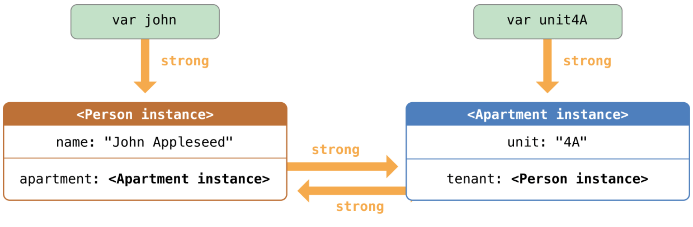
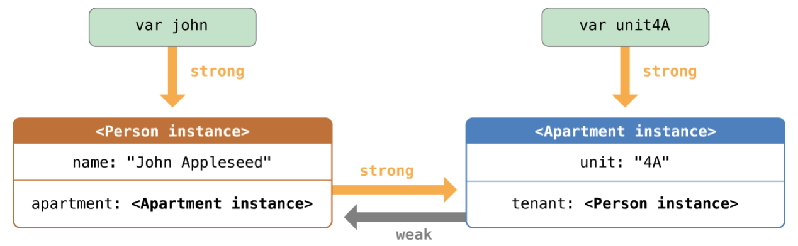

# ARC (Автоматический подсчет ссылок)

## 1. Общие сведения

- Swift использует automatic reference counting (автоматический подсчет ссылок) для отслеживания и управления памятью вашего приложения.
- ARC автоматически освобождает память, которая использовалась экземплярами класса, когда эти экземпляры больше нам не нужны.
- ARC применима только для экземпляров класса. Структуры и перечисления являются типами значений, а не ссылочными типами, и они не хранятся и не передают свои значения по ссылке.

## 1. Работа ARC

- Каждый раз, когда вы создаете экземпляр класса, ARC выделяет фрагмент памяти для хранения информации этого экземпляра. Этот фрагмент памяти содержит информацию о типе экземпляра, о его значении и любых свойствах хранения, связанных с ним.
- Дополнительно, когда экземпляр больше не нужен, ARC освобождает память, использованную под этот экземпляр, и направляет эту память туда, где она нужна. Это своего рода гарантия того, что ненужные экземпляры не будут занимать память.
- Однако, если ARC освободит память используемого экземпляра, то доступ к свойствам или методам этого экземпляра будет невозможен. Если вы попробуете получить доступ к этому экземпляру, то ваше приложение скорее всего выдаст ошибку и будет остановлено.
- Для того, чтобы нужный экземпляр не пропал, ARC ведет учет количества свойств, констант, переменных, которые ссылаются на каждый экземпляр класса. ARC не освободит экземпляр, если есть хотя бы одна активная ссылка.
- Для того чтобы это было возможно, каждый раз как вы присваиваете экземпляр свойству, константе или переменной создается **strong reference** (сильная ссылка) с этим экземпляром. Такая связь называется “сильной”, так как она крепко держится за этот экземпляр и не позволяет ему освободится до тех пор, пока остаются сильные связи.

## 2. ARC в действии

- ARC не освободит экземпляр класса Person в примере до тех пор, пока остается последняя сильная ссылка, уничтожив которую мы укажем на то, что наш экземпляр больше не используется, после этого вызовится деинициализатор и освободится память

```Swift
class Person {
    let name: String
    init(name: String) {
        self.name = name
        print("\(name) инициализируется")
    }
    deinit {
        print("\(name) деинициализируется")
    }
}

var reference1: Person?
var reference2: Person?
var reference3: Person?

reference1 = Person(name: "John Appleseed")
// Выведет "John Appleseed инициализируется"

reference2 = reference1
reference3 = reference1

reference1 = nil
reference2 = nil

reference3 = nil
// Выведет "John Appleseed деинициализируется"
```

## 3. Циклы сильных ссылок между экземплярами классов

- **Цикл сильных ссылок** - это когда экземпляры классов имеют сильные связи друг с другом, что не позволяет им освободиться.

```Swift
class Person {
    let name: String
    init(name: String) { self.name = name }
    var apartment: Apartment?
    deinit { print("\(name) освобождается") }
}
 
class Apartment {
    let unit: String
    init(unit: String) { self.unit = unit }
    var tenant: Person?
    deinit { print("Апартаменты \(unit) освобождаются") }
}

var john: Person?
var unit4A: Apartment?

// картинка 1
john = Person(name: "John Appleseed")
unit4A = Apartment(unit: "4A")

// картинка 2
john!.apartment = unit4A
unit4A!.tenant = john

// картинка 3
// Сильные взаимные ссылки остались между экземплярами Person и Apartment и не могут быть разрушены.
john = nil
unit4A = nil

```

#### Картинка 1  


#### Картинка 2  


#### Картинка 3  


## 4. Замена циклов сильных ссылок между экземплярами классов

- Вы сами решаете, когда сделать вместо сильной (**strong**) ссылки слабую (**weak**) или бесхозную (**unowned**).
- Слабые и бесхозные ссылки позволяют одному экземпляру в цикле ссылок ссылаться на другой экземпляр без сильного прикрепления. Экземпляры могут ссылаться друг на друга без создания цикла сильных связей.
- **Используйте слабую ссылку**, если другой экземпляр имеет более короткое время жизни, то есть когда другой экземпляр может быть освобожден первым.
- **Используйте бесхозные ссылки**, если другой экземпляр имеет одинаковое время жизни или более длительный срок службы.

## 5. Слабые (weak) ссылки

- Слабые ссылки не удерживаются за экземпляр, на который они указывают, так что ARC не берет их во внимание, когда считает ссылки экземпляра.
- Так как слабая ссылка не сильно держит экземпляр, то этот экземпляр может быть освобожден, пока слабая ссылка все еще ссылается на него. Таким образом ARC автоматически присваивает слабой ссылке nil, когда экземпляр, на который она указывает, освобождается. 
- И поскольку слабые ссылки должны позволять изменять их значение до nil во время выполнения, они всегда объявляются как переменные, а не как константы опционального типа.
- Когда ARC устанавливает слабую ссылку на nil, наблюдатели свойств не вызываются.

```Swift
class Person {
    let name: String
    init(name: String) { self.name = name }
    var apartment: Apartment?
    deinit { print("\(name) деинициализируется") }
}
 
class Apartment {
    let unit: String
    init(unit: String) { self.unit = unit }
    weak var tenant: Person?
    deinit { print("Apartment \(unit) деинициализируется") }
}

var john: Person?
var unit4A: Apartment?
 
john = Person(name: "John Appleseed")
unit4A = Apartment(unit: "4A")

// Картинка 4
john!.apartment = unit4A
unit4A!.tenant = john

// Картинка 5
john = nil
// Выведет "John Appleseed деинициализируется"

// Картинка 6
unit4A = nil
// выводит "Апартаменты 4A деинициализируется"
```

#### Картинка 4  


#### Картинка 5  


#### Картинка 6  


## 6. Бесхозные (unowned) ссылки

- Классы - ссылочный тип, структуры - тип значения

```Swift

```