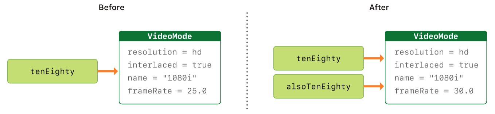

# Struct & Class (Структуры и Классы)

## 1. Общее у Структур и Классов

- У обоих можно объявлять: свойства, методы, индексы (сабскрипты), инициализаторы
- Оба могут быть расширены

## 2. Различия у Структур и Классов


## 4. Синтаксис объявления

```Swift
struct Resolution {
    var width = 0
    var height = 0
}
class VideoMode {
    var resolution = Resolution()
    var interlaced = false
    var frameRate = 0.0
    var name: String?
}
```

## 5. Экземпляры класса и структуры

```Swift
let someResolution = Resolution()
let someVideoMode = VideoMode()
```

## 6. Доступ к свойствам

- доступ к свойствам осуществляется через точечный синтаксис

```Swift
print(someResolution.width)
print(someVideoMode.resolution.width)
```

## 7. Поэлементные инициализаторы структурных типов

```Swift
let vga = Resolution(width: 640, height: 480)
```


## 8. Структуры и перечисления - типы значения

- Тип значения - это тип, при копировании которого копируется **значение** текущего экземпляр.


## 9. Классы - ссылочный тип

- Ссылочный тип - это тип, при копировании которого копируется **ссылка** на текущий экземпляр.



## 10. Операторы тождественности

- Операторы тождественности - проверяют ссылаются ли две константы или переменные на один и тот же экземпляр класса. 
  - Идентичен (===)
  - Не идентичен (!==)
