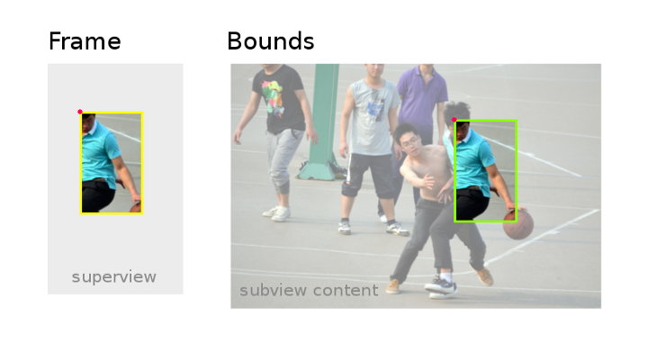

# Различие Frame и Bounds в iOS. Frame vs Bounds in iOS.

> [Источник информации](https://vmityuklyaev.medium.com/различие-frame-и-bounds-в-ios-frame-vs-bounds-in-ios-4e5aee5ed477)


## Краткое описание

- frame — расположение и размер view с использованием системы координат родительского представления (важно для размещения представления в superview).
- bounds — местоположение и размер представления с использованием его собственной системы координат (важно для размещения содержимого View или subview внутри него)

## Когда использовать frame и когда использовать bounds.

- Поскольку frame связывает местоположение view в superview, используйте его при внесении внешних изменений: ширины или вычисления расстояния между view и вериной его родительского view.
- Используйте bounds для внутренних изменений: рисования или организации subview в пределах view. Также используйте bounds для получения размера view, если вы сделали какие-то преобразование для него.


## Frame vs Bounds


- Желтый прямоугольник показывает frame у view.
- Зеленый прямоугольник изображает bounds у view. Bounds ничего не знает о superview.
- Красная точка на обоих изображениях обозначает origin

```Swift
Frame
    origin = (x: 0, y: 0)
    width = 80
    height = 130

Bounds 
    origin = (x: 0, y: 0)
    width = 80
    height = 130
```


- Видно, что изменение x-y координат frame перемещает изображение на родительском view. Но его содержимое выглядит точно также. Bounds понятие не имеет что что-то изменилось.


```Swift
Frame
     origin = (x: 40, y: 60)
     width = 80
     height = 130
 
Bounds 
     origin = (x: 0, y: 0)
     width = 80
     height = 130
```


- Видно, что bounds остался прежним. Он до сих пор не знает что произошло.
- frame это самая наименьшая ограничительная рамка для view относительно его родительской системы координат, включающая любые преобразования, примененные к этому представлению.
- При изменении, у view свойства transform, все преобразования выполняются относительно центральной точки view.

```Swift
Frame
   origin = (x: 20, y: 52) // Это примерные значения.
   width = 118
   height = 187
 
Bounds 
   origin = (x: 0, y: 0)
   width = 80
   height = 130
```



- Frame не перемещался на superview, но контент внутри frame изменился, потому что начало прямоугольника bounds начинается в другой части view.

```Swift
Frame
    origin = (x: 40, y: 60)
    width = 80
    height = 130
 
Bounds 
    origin = (x: 280, y: 70)
    width = 80
    height = 130
```

