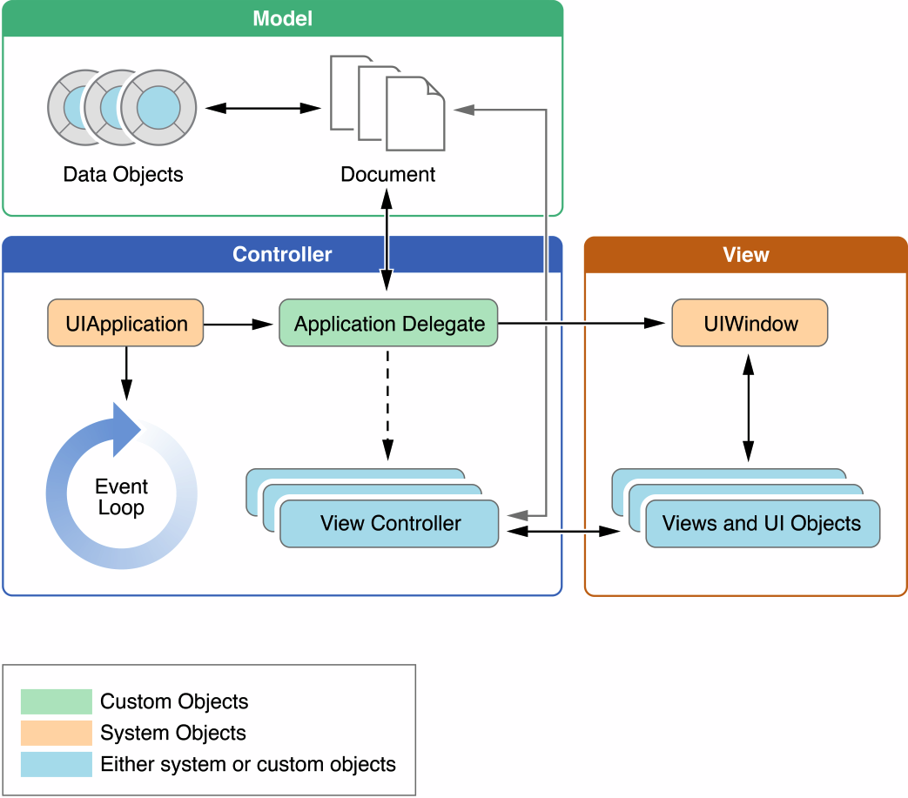

# Жизненный цикл приложения

> [Источник информации](https://medium.com/@yo.kononov/разбор-вопросов-на-собеседование-junior-ios-developer-b27604211f5a)


## Основная функция

- Входной точкой входа в каждом приложении основанном на C является функция main. в iOS приложениях это правильно так же соблюдается. Единственное чем отличается, это то, что в iOS приложении вы не должны писать в функцию main самостоятельно. Xcode создает эту функцию как часть основы для вашего проекта. Правда, в языке Swift такой функции уже не наблюдается. Единственное что можно сказать о функции main это то, что работа передается под управление фреймворка UIKit. Функция UIApplicationMain передает этот процесс созданием объекта ядра вашего приложения, загрузкой пользовательского интерфейса вашего приложения из файлов storyboard, вызовом вашего кода, что дает вам шанс настроить что-то во время запуска, и вложение вашего приложения в цикл. Единственной вещью, что вам необходимо предоставить, это файлы storyboard и ваш инициализационный код.

```Objective-C
//Main function on Objective-C
#import <UIKit/UIKit.h>
#import "AppDelegate.h"
int main(int argc, char * argv[])
{
	@autoreleasepool {
		return UIApplicationMain(argc, argv, nil, NSStringFromClass([AppDelegate class]));
	}
}
```

## Структура приложения
- Во время запуска, функция UIApplicationMain выбирает несколько ключевых объектов и запускает приложение. В сердце каждого iOS приложения лежит объект UIApplication, который способствует взаимодействию между системой и другими объектами приложения. На рисунке показаны основные объекты которые можно найти в большинстве приложений, Таблица описывает роли которые играет каждый объект. Обратите внимание, что iOS приложение использует MVC архитектуру. Этот паттерн отделяет данные приложение от бизнес-логики и визуальным представлением данных. Эта архитектура ключевая в создании приложения, которое способно запускаться на различных устройствах с различными размерами экрана.Life	




- Чем отлично одно iOS приложение от другого, так это управлением данными (и соответствующая бизнес-логика) и то как они представляются пользователю. Большинство взаимодействий объектов UIKit не определяет ваше приложение, но помогает вам усовершенствовать его поведение. Например, методы вашего приложения делегируются когда приложение измененяет состояние, и вы определяете в своем коде то, как нужно отреагировать на изменение соответствующим образом.

## Основной цикл работы

- Основной цикл работы приложения обрабатывает все пользовательские события. Объект UIApplication запускает основной цикл с момента запуска и использует его для обработки событий и обработки изменений в интерфейсе. Как следует из названия, основной цикл выполняется в основном потоке приложения. Такое поведение гарантирует, что события связные с пользователем будут обрабатываться последовательно в том порядке в котором они были получены.

- На рисунке изображена архитектура основного цикла и то как совершается обработка пользовательских событий после их получения в вашем приложении. Когда пользователь взаимодействует с устройством, события, связанные с этим взаимодействием генерируются системой через специальный порт созданный UIKit. События помещаются в очередь внутри приложения и направляются один за другим в основной цикл для исполнения. Объект UIApplication это первый объект который принимает события и принимает решение о том, что с ним должно быть сделано. События касания (touch) обычно направляется на объект главного окна, которое в свою очередь пересылает это сообщение в view, в котором произошло это касание. Другие события могут быть приняты немного другим путями через различные объекты приложения.


- Много типов событий может поставляться в приложениях iOS. Основная их часть отображена в таблице. Много этих типов событий поставляются используя основной цикл, но некоторые нет. 


- Некоторые события, такие как касание или удаленный доступ, могут приниматься ответившими объектами (responder objects). Такие объекты везде в вашем приложении. (Объект UIApplication, ваш view объект, и ваш view controller объекты, все примеры ответивших объектов.) Основными целями событий являются ответившие объекты, но могут быть переданы другими ответившими объектами (через цепочку ответивших (responder chain)) если вам нужно обработать события. Например, view не имеет перехватчика, событие может передать событие через superview или view controller.

- Событие касания происходящие в controls (таких как кнопки) обрабатываются иначе, чем в события касания происходящие на многих других типах view. Как правило, только на ограниченное число взаимодействий возможно с control, и эти события упакованы в action сообщения и отправляются в соответсвующий целевой объект. Этот паттерн, называемый target-action упрощает использование control для включения вашего кода в приложении.

## Стадии работы приложения

- В любой момент времени ваше приложение находится в одном из пяти состояний:


- Сейчас рассмотрим как же приложение меняет эти состояния. На картинке ниже представлена схема состояний.


- Основные перемещения между состояния вызывают определенные методы указанные в объекте приложения. Эти методы дают вам возможность обработать изменение состояний.

  - **application:willFinishLaunchingWithOptions:** — Этот метод вашего приложения позволяет вам выполнять код во время запуска приложения.
  - **application:didFinishLaunchingWithOptions:** — Этот метод позволяет вам перед окончанием запуска выполнить код прежде чем показать ваше приложение пользователю.
  - **applicationDidBecomeActive:** — Дает вам знать, что оно становятся приложением переднего плана. Используйте этот метод для последних приготовлений.
  - **applicationWillResignActive:** — Дает вам знать, что приложение уходит из режима переднего плана. Используйте этот метод для помещения вашего приложения в режим покоя.
  - **applicationDidEnterBackground:** — Дает вам знать, что приложение запущено в фоне и может быть выключено в любое время.
  - **applicationWillEnterForeground:** — Дает вам знать, что ваше приложение перемещено из фона обратно на передний план, но то, что оно еще не активно.
  - **applicationWillTerminate:** — Дает вам знать, что приложение было выключено. Этот метод не вызывается, если приложение было в состоянии suspended(приостановлено).

## Выключение приложения

- Приложение должно быть всегда готово к тому, что его могут отключить в любое время и не должно ждать, пока сохранятся какие-то настройки или данные. Выключение это нормальная часть жизненного цикла приложения. Система обычно выключает приложения, для очищения памяти или подготовки к запуску других приложений, которые запущены пользователем, но система так же может выключить приложения, которые работают некорректно или не отвечают.

- Приложения в приостановленном режиме не получают уведомления о завершении. Система убивает процесс и восстанавливает соотвествующую память. Если приложение запущено в фоне и не отвечает, система вызовет applicationWillTerminate: чтобы приложение подготовилось к выключению. Система не вызывает метод когда устройство перезагружается.

- В дополнение, система выключает выше приложение, когда пользователь выключил его с помощью интерфейса мультизадачности. Выключение вызванное пользователем вызывает такой же эффект как при выключении приложения в приостановленном режиме. Процессы приложения удаляется так же без предупреждения.

## Потоки и параллельная работа

- Система создает приложение в основном потоке и вы можете создавать отдельные потоки, если вам это необходимо, для решения каких либо задач. Для приложений iOS, предпочтительным методом является использование Grand Central Dispatch (GCD), оперирущим с объектами, и другиим интерфейсами асинхронного программирования не создавая и управляя потоками собственоручно. Такие технологии как GCD позволяют определить работу, которую вы хотите сделать и в каком порядке вы хотите ее сделать, но пусть система решает как лучше выполнить эту работу для CPU. Когда система управляет вашими потоками вам становиться легче писать код, идет лучше понимание кода, а так же увеличивает общую производительность приложения.

- Когда мы думает о потоках и парралельной работе, необходимо учитывать следующее:
  - Работа с включающими view, Core Animation, и многими другими классами UIKit должны происходить в основном потоке. Есть некоторые исключения из этих правилах, например манипуляции с изображениями могут встретится в фоновых потоках, но предположим, что работа должна выполняться в основном потоке

  - Долго выполняющиеся задачи (или потенциально долгие задачи) должны всегда выполняться в фоновых потоках. Любые задачи связанные с доступом в интернет, к файловой системе или большие обработки данных, все должны выполняться асинхронно с использованием GCD или оперирующими объектами.
  - Во время запуска, перемещайте задачи из основного потока, когда это возможно. Во время запуска, ваше приложение должно использовать имеющееся время для запуска пользовательского интерфейса настолько быстро насколько это возможно. Только задачи, которые относятся к созданию пользовательского интерфейса должны быть выполнены в основном потоке. Все другие задачи должны выполняться асинхронно, отправляющие результат работы когда он будет готов.

